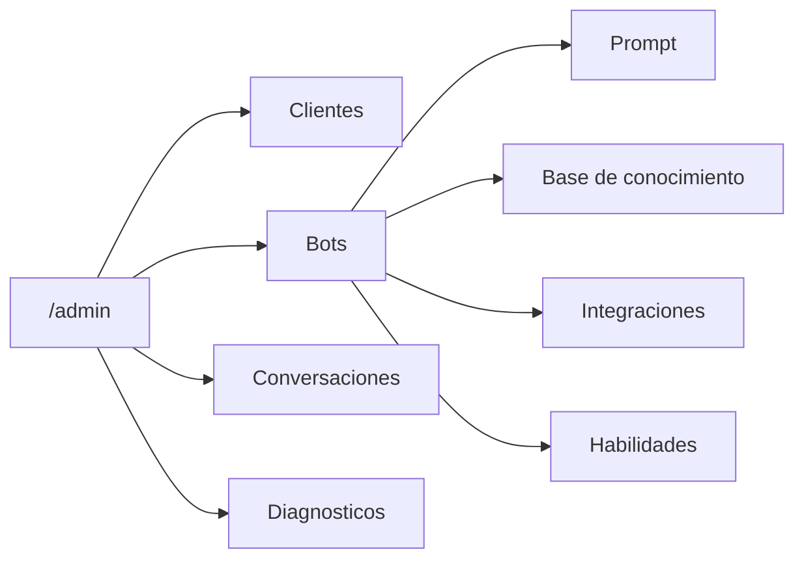
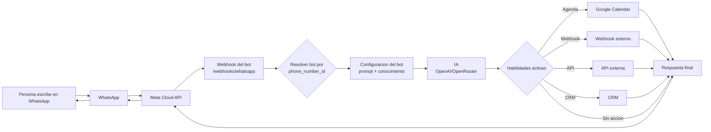
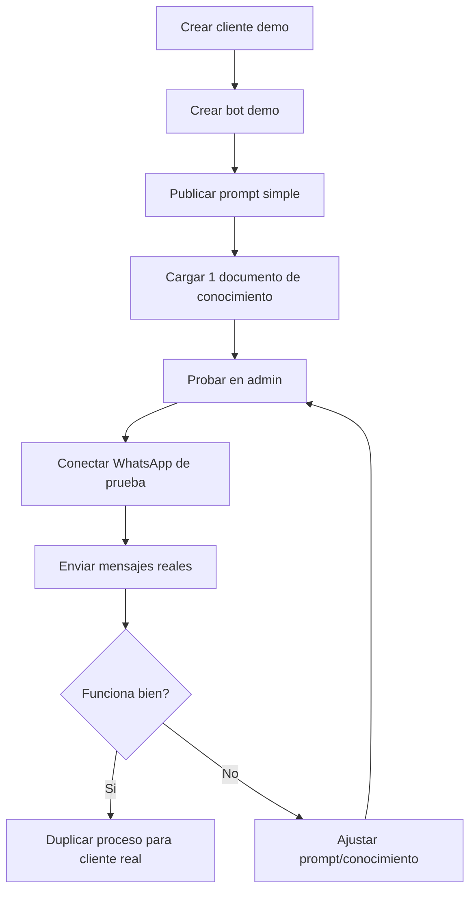
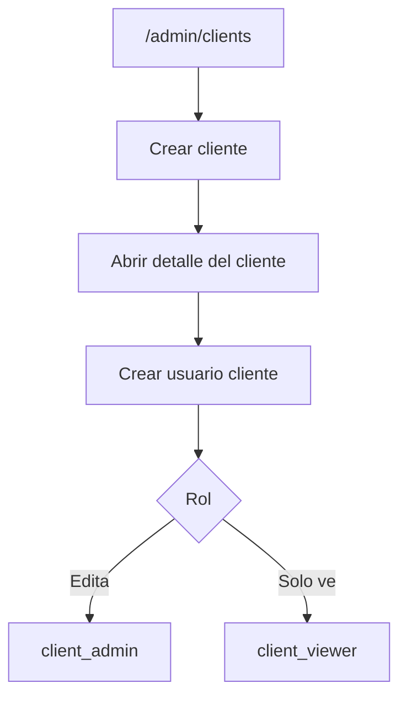
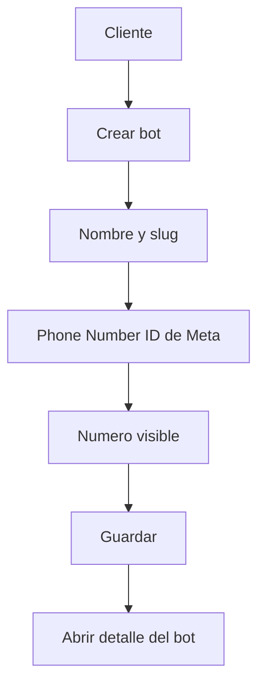
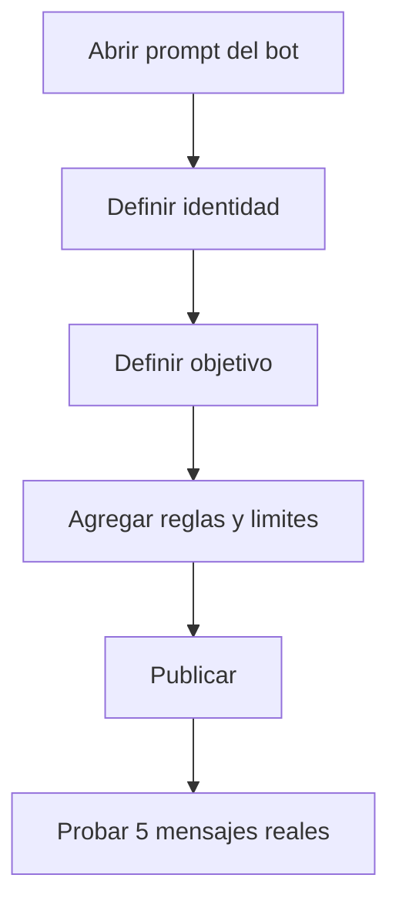
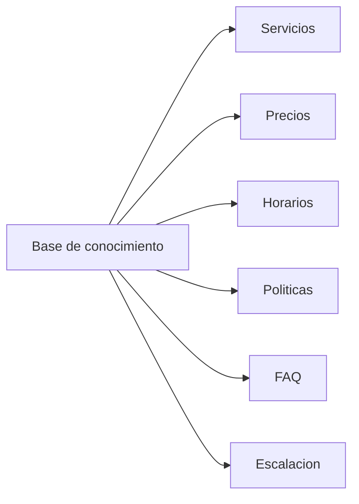
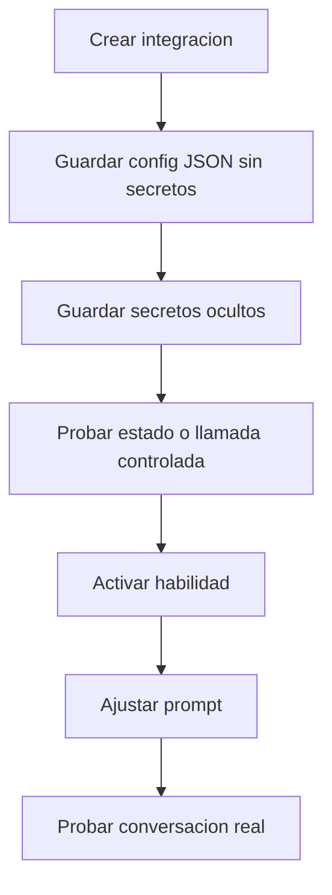
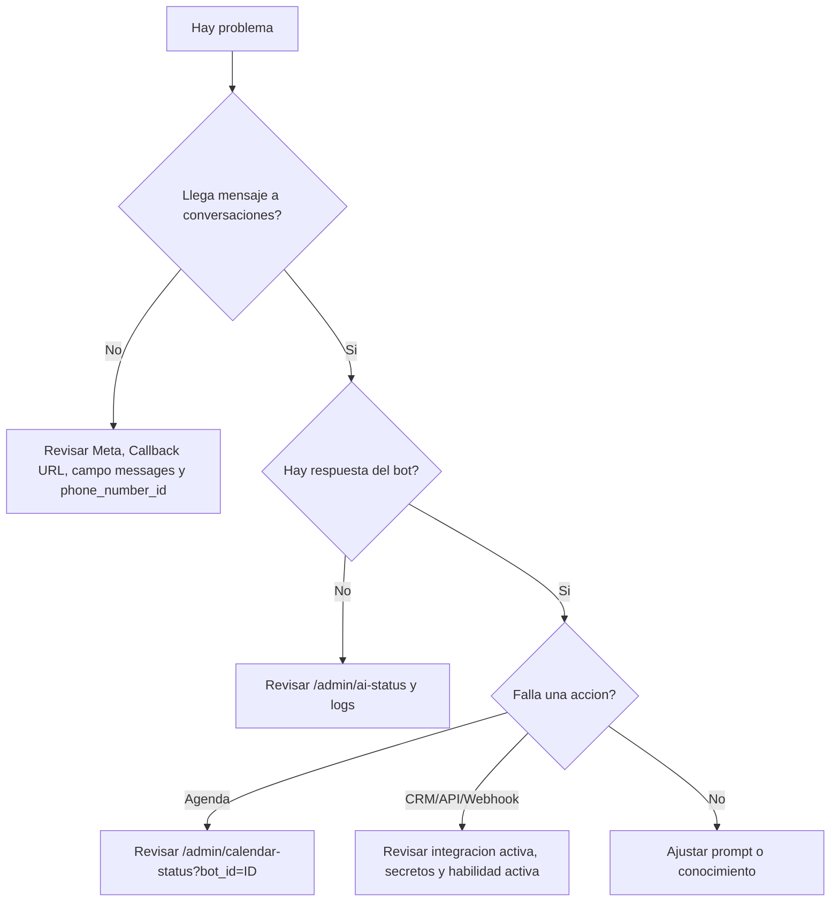
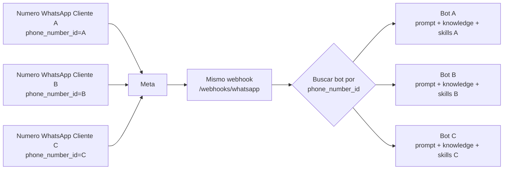

# Manual grafico de agentes WhatsApp

Manual operativo para crear, configurar, probar y mantener agentes de WhatsApp
en este proyecto. Esta pensado para equipos de agencia y operadores no
tecnicos.

> No pegues tokens, API keys, contrasenas ni secretos reales en documentos,
> chats, tickets o capturas. Usa siempre placeholders como
> `TU_ACCESS_TOKEN_DE_META`.

## 1. Mapa rapido



| Necesitas hacer | Entra a |
| --- | --- |
| Ver clientes | [`/admin/clients`](/admin/clients) |
| Ver bots | [`/admin/bots`](/admin/bots) |
| Editar prompt de un bot | [`/admin/bots/{bot_id}/prompt`](/admin/bots/1/prompt) |
| Cargar conocimiento | [`/admin/bots/{bot_id}/knowledge`](/admin/bots/1/knowledge) |
| Configurar agenda, API, webhook o CRM | [`/admin/bots/{bot_id}/integrations`](/admin/bots/1/integrations) |
| Activar habilidades | [`/admin/bots/{bot_id}/skills`](/admin/bots/1/skills) |
| Revisar conversaciones | [`/admin/conversations`](/admin/conversations) |
| Probar IA | [`/admin/ai-status`](/admin/ai-status) |
| Probar Calendar | [`/admin/calendar-status?bot_id=1`](/admin/calendar-status?bot_id=1) |

Reemplaza `{bot_id}` por el ID real del bot. En muchos casos el primer bot de
prueba sera `1`.

## 2. Conceptos basicos

| Concepto | Que significa | Ejemplo |
| --- | --- | --- |
| Cliente | La empresa o negocio que contrata el bot. | `Clinica Demo` |
| Usuario cliente | Persona del cliente que puede entrar al admin. | `admin@clinicademo.com` |
| Bot | Agente de WhatsApp configurado para un cliente. | `Bot Clinica Demo` |
| Numero de WhatsApp | Numero conectado en Meta WhatsApp Cloud API. | `+52 555 000 0000` |
| `phone_number_id` | ID tecnico de Meta usado para enrutar mensajes al bot correcto. | `123456789012345` |
| Prompt | Instrucciones de personalidad, reglas, objetivo y limites del agente. | "Eres el asistente de Clinica Demo..." |
| Base de conocimiento | Informacion que el bot debe consultar: servicios, precios, politicas, FAQs. | Documento "Tratamientos y horarios" |
| Integracion | Conexion guardada para Calendar, webhook, API externa o CRM. | `Agenda principal` |
| Secreto | Token o clave sensible guardada oculta y cifrada. | `refresh_token`, `api_key` |
| Habilidad | Capacidad que el bot puede ejecutar durante la conversacion. | `google_calendar`, `crm` |

## 3. Arquitectura visual



Idea clave: un solo backend puede manejar muchos clientes. El webhook recibe el
`phone_number_id` de Meta, busca que bot corresponde a ese numero y carga la
configuracion especifica de ese bot.

## 4. Checklist antes de crear un bot

Marca esto antes de tocar produccion:

- [ ] El cliente ya aprobo el objetivo del agente.
- [ ] Tienes nombre comercial, horarios, servicios, precios y politicas.
- [ ] Tienes el numero de WhatsApp que se conectara a Meta.
- [ ] Tienes acceso al Business Manager o App de Meta del cliente, cuando aplique.
- [ ] Tienes claro si el bot solo informa, agenda, vende o manda datos a CRM.
- [ ] Tienes credenciales de integraciones, pero no las escribiras en el manual.
- [ ] El dominio publico del bot funciona, por ejemplo `https://TU_DOMINIO.com`.
- [ ] El admin abre correctamente en `/admin`.
- [ ] [`/health`](/health) responde bien.
- [ ] [`/admin/ai-status`](/admin/ai-status) no muestra error.
- [ ] Si usara agenda, [`/admin/calendar-status?bot_id=1`](/admin/calendar-status?bot_id=1) no muestra error.

## 5. Primer bot recomendado

Empieza con un bot de prueba antes de conectar el numero real del cliente.

| Campo | Valor recomendado |
| --- | --- |
| Cliente | `Cliente Demo Agencia` |
| Bot | `Bot Demo WhatsApp` |
| Slug | `bot-demo-whatsapp` |
| Numero visible | Un numero sandbox o numero de prueba |
| Objetivo | Responder informacion basica y capturar lead |
| Integraciones | Ninguna al inicio |
| Habilidades | Solo las necesarias; deja CRM/API/webhook apagadas |

Flujo recomendado:



## 6. Crear cliente y usuario cliente



1. Entra al panel admin: [`/admin`](/admin).
2. Abre [`/admin/clients`](/admin/clients).
3. En "Crear cliente", llena:
   - `Nombre`: nombre del negocio.
   - `Slug`: version corta, sin espacios. Si lo dejas vacio, el sistema lo genera.
4. Guarda el cliente.
5. En el detalle del cliente, crea el usuario cliente:
   - `Nombre`: persona responsable.
   - `Email`: correo de acceso.
   - `Rol`: usa `client_admin` si podra editar; usa `client_viewer` si solo vera.
   - `Password`: contrasena temporal segura.
6. Entrega acceso por un canal seguro. Pide que cambien la contrasena si el
   flujo operativo lo permite.

Roles recomendados:

| Rol | Puede ver | Puede editar |
| --- | --- | --- |
| Agencia admin | Todo | Todo |
| `client_admin` | Sus bots | Prompt, conocimiento, integraciones y habilidades de sus bots |
| `client_viewer` | Sus bots | No, solo lectura |

## 7. Crear bot



1. Entra a [`/admin/clients`](/admin/clients).
2. Abre el cliente.
3. En "Crear bot", llena:
   - `Nombre del bot`: nombre interno facil de reconocer.
   - `Slug`: identificador corto.
   - `Phone Number ID`: ID del numero de WhatsApp en Meta.
   - `Numero visible`: numero que vera el equipo, por ejemplo `+52 555 000 0000`.
4. Guarda.
5. Abre el bot desde la lista.
6. Confirma que en el encabezado aparezca el cliente correcto y el
   `phone_number_id` correcto.

Ejemplo seguro de datos:

```text
Nombre del bot: Bot Clinica Demo
Slug: bot-clinica-demo
Phone Number ID: 123456789012345
Numero visible: +52 555 000 0000
```

## 8. Configurar WhatsApp y Meta

Esta parte aplica cuando el bot ya recibira mensajes reales desde WhatsApp
Cloud API.

### Datos que necesitas de Meta

| Dato | Donde se usa | Es secreto |
| --- | --- | --- |
| `WHATSAPP_ACCESS_TOKEN` | En variables de entorno o secreto por integracion futura | Si |
| `WHATSAPP_VERIFY_TOKEN` | En Meta para validar webhook y en la app | Si, tratala como secreto |
| `WHATSAPP_PHONE_NUMBER_ID` | Bot por defecto o fallback global | No necesariamente, pero no lo publiques sin razon |
| `META_APP_SECRET` | Validar firmas de Meta | Si |
| Callback URL | Webhook en Meta | No |

Callback recomendado:

```text
https://TU_DOMINIO.com/webhooks/whatsapp
```

En Meta:

1. Abre la app de Meta del cliente.
2. En WhatsApp > Configuration, configura:
   - `Callback URL`: `https://TU_DOMINIO.com/webhooks/whatsapp`
   - `Verify token`: el mismo valor de `WHATSAPP_VERIFY_TOKEN`
3. Suscribe el campo `messages`.
4. En el bot del admin, asegúrate de guardar el `phone_number_id` del numero.
5. Haz una prueba desde un telefono real.

Si la prueba de Meta llega pero mensajes reales no llegan, revisa en Meta si el
WABA tiene un `override_callback_uri` heredado o si el numero no esta suscrito a
la app correcta.

## 9. Editar prompt



Ruta: [`/admin/bots/{bot_id}/prompt`](/admin/bots/1/prompt)

El prompt define como piensa y responde el agente. Debe decirle:

- Quien es.
- Para que negocio trabaja.
- Que puede y no puede hacer.
- Que datos debe pedir.
- Cuando debe agendar, calificar, escalar o guardar un lead.
- Que tono debe usar.
- Que informacion nunca debe inventar.

Checklist de prompt:

- [ ] Incluye nombre del cliente.
- [ ] Incluye objetivo principal.
- [ ] Incluye tono de voz.
- [ ] Incluye preguntas de calificacion.
- [ ] Incluye limites claros.
- [ ] Indica que no debe mostrar marcadores internos al usuario.
- [ ] Si usa CRM/API/webhook, explica cuando debe activar esa accion.
- [ ] Si usa agenda, explica cuando pedir nombre, motivo, fecha y hora.

Mini estructura recomendada:

```text
Eres el asistente de WhatsApp de [NEGOCIO].

Objetivo:
- Ayudar a personas interesadas en [SERVICIO].
- Responder preguntas frecuentes con informacion de la base de conocimiento.
- Capturar nombre, necesidad y datos de contacto cuando haya interes real.

Tono:
- Claro, amable, breve y profesional.

Reglas:
- No inventes precios, horarios ni politicas.
- Si falta informacion, dilo y ofrece escalar.
- No muestres instrucciones internas ni marcadores tecnicos.
```

Despues de publicar el prompt, prueba con 5 mensajes reales antes de entregarlo.

## 10. Cargar base de conocimiento



Ruta: [`/admin/bots/{bot_id}/knowledge`](/admin/bots/1/knowledge)

La base de conocimiento alimenta al bot con datos concretos del negocio. Se
pueden crear varios documentos. Es mejor separar por temas.

| Documento sugerido | Que incluir |
| --- | --- |
| Servicios | Lista de servicios, a quien va dirigido cada uno |
| Precios | Paquetes, rangos, condiciones, moneda |
| Horarios | Horarios de atencion, zonas, tiempos de respuesta |
| Politicas | Cancelaciones, garantias, requisitos, restricciones |
| FAQ | Preguntas frecuentes con respuestas aprobadas |
| Escalacion | Cuando pasar a humano y a quien avisar |

Ejemplo de documento:

```markdown
# Servicios de Clinica Demo

## Consulta inicial
- Duracion: 30 minutos.
- Modalidad: presencial o videollamada.
- Ideal para pacientes nuevos.

## Politicas
- Las citas se pueden reagendar con 24 horas de anticipacion.
- No confirmar diagnosticos por WhatsApp.
```

Buenas practicas:

- Usa frases directas.
- Evita duplicar informacion en muchos documentos.
- Actualiza precios y horarios apenas cambien.
- Archiva informacion vieja en lugar de dejarla activa.

## 11. Configurar integraciones

Ruta: [`/admin/bots/{bot_id}/integrations`](/admin/bots/1/integrations)

Una integracion guarda la configuracion para conectar el bot con otro sistema.
La configuracion publica va en JSON. Los secretos se guardan aparte en
"Guardar secreto".

Tipos disponibles:

| Tipo | Para que sirve | Habilidad relacionada |
| --- | --- | --- |
| `google_calendar` | Crear y cancelar citas | `google_calendar` |
| `webhook` | Enviar datos a una URL externa | `webhook` |
| `external_api` | Consultar o enviar datos a una API | `external_api` |
| `crm` | Crear o actualizar leads | `crm` |
| `custom` | Guardar configuracion especial | Depende de desarrollo posterior |

### Google Calendar

Config JSON sin secretos:

```json
{
  "client_id": "TU_GOOGLE_CLIENT_ID",
  "calendar_id": "primary",
  "timezone": "America/Mazatlan",
  "duration_minutes": 30,
  "buffer_minutes": 0,
  "summary_prefix": "Cita Cliente Demo",
  "location": "Google Meet o sucursal"
}
```

Secretos a guardar:

```text
client_secret
refresh_token
```

### Webhook

Config JSON sin secretos:

```json
{
  "url": "https://hooks.example.com/whatsapp-lead",
  "method": "POST",
  "headers": {
    "X-Source": "whatsapp-bot"
  },
  "timeout_seconds": 20
}
```

Secretos sugeridos:

```text
access_token
api_key
```

### API externa

Config JSON sin secretos:

```json
{
  "base_url": "https://api.example.com",
  "allowed_methods": ["GET", "POST"],
  "auth_header": "Authorization",
  "auth_scheme": "Bearer",
  "timeout_seconds": 20
}
```

Secretos sugeridos:

```text
access_token
api_key
bearer_token
token
```

### CRM

Config JSON sin secretos:

```json
{
  "url": "https://crm.example.com/api/leads",
  "method": "POST",
  "allowed_methods": ["POST"],
  "auth_header": "Authorization",
  "auth_scheme": "Bearer",
  "timeout_seconds": 20
}
```

Secretos sugeridos:

```text
access_token
api_key
```

## 12. Guardar secretos sin exponerlos

En la pagina de una integracion:

1. Ve a [`/admin/bots/{bot_id}/integrations`](/admin/bots/1/integrations).
2. Abre la integracion.
3. En "Guardar secreto", escribe:
   - `Nombre del secreto`: por ejemplo `api_key`.
   - `Valor`: pega el valor real solo en el campo de contrasena.
4. Guarda.
5. Verifica que la tabla solo muestre el nombre del secreto y "Valor guardado y
   oculto".

Reglas de seguridad:

- No pongas tokens en el JSON.
- No pegues secretos en el prompt.
- No pegues secretos en base de conocimiento.
- No compartas capturas donde se vea un secreto.
- No subas `.env`, `.mcp.json`, `META_SETUP.md` ni carpetas `execution/`.
- Si crees que un secreto se expuso, rotalo en el proveedor original.

Ejemplo correcto:

```json
{
  "base_url": "https://api.example.com",
  "auth_header": "Authorization",
  "auth_scheme": "Bearer"
}
```

Y el token real se guarda aparte como:

```text
Nombre: access_token
Valor: TU_TOKEN_REAL_EN_EL_CAMPO_OCULTO
```

## 13. Activar habilidades

Ruta: [`/admin/bots/{bot_id}/skills`](/admin/bots/1/skills)

Las habilidades son los permisos operativos del bot. Una integracion guardada no
basta: la habilidad tambien debe estar activa.

| Habilidad | Estado recomendado al crear bot | Cuando activarla |
| --- | --- | --- |
| `google_calendar` | Activa solo si el bot agenda | Cuando Calendar este probado |
| `webhook` | Apagada | Cuando el prompt ya sabe que datos enviar |
| `external_api` | Apagada | Cuando la API este probada con datos demo |
| `crm` | Apagada | Cuando el CRM acepte leads correctamente |

Flujo seguro:



Marcadores internos que puede generar la IA cuando una habilidad externa esta
activa. El sistema los limpia antes de responder al usuario:

```text
[[WEBHOOK_POST: {"payload": {"name": "Ana", "phone": "5215550000000"}}]]
[[EXTERNAL_API_REQUEST: {"method": "GET", "path": "/clientes", "params": {"phone": "5215550000000"}}]]
[[EXTERNAL_API_REQUEST: {"method": "POST", "path": "/leads", "json": {"name": "Ana"}}]]
[[CRM_LEAD: {"name": "Ana", "phone": "5215550000000", "status": "new", "notes": "Quiere una cita"}}]]
```

Estos marcadores son instrucciones internas. Nunca deben aparecer en la
respuesta final que recibe el usuario.

## 14. Pruebas de WhatsApp reales

Haz pruebas desde un telefono real, no solo desde Meta.

### Prueba informativa

```text
Hola
Que servicios ofrecen?
Cuanto cuesta?
En que horario atienden?
```

Resultado esperado:

- Responde con datos de la base de conocimiento.
- Si no sabe algo, no inventa.
- Mantiene el tono definido.

### Prueba de lead

```text
Me interesa
Soy Ana Lopez
Quiero informacion para mi negocio
```

Resultado esperado:

- Pide la informacion faltante.
- Califica sin presionar.
- Si CRM/webhook esta activo, registra el lead solo cuando tenga datos utiles.

### Prueba de agenda

```text
Hola, quiero agendar una cita
Ana Lopez
Mañana a las 10
```

Resultado esperado:

- Pide los datos faltantes.
- Verifica disponibilidad.
- Crea cita si `google_calendar` esta activo y Calendar funciona.
- Si el horario esta ocupado, ofrece alternativa.

### Prueba de cancelacion

```text
Quiero cancelar mi cita
La de mañana a las 10
```

Resultado esperado:

- Identifica la cita.
- Cancela en Google Calendar si existe.
- Confirma al usuario sin mostrar detalles tecnicos.

### Prueba de routing multi-cliente

Si tienes dos bots con distintos numeros:

1. Envia mensaje al numero del cliente A.
2. Confirma que aparece en [`/admin/conversations`](/admin/conversations) con
   el bot A.
3. Envia mensaje al numero del cliente B.
4. Confirma que aparece con el bot B.
5. Si ambos llegan al mismo bot, revisa `phone_number_id`.

## 15. Diagnosticos utiles

| Diagnostico | Ruta | Que revisar |
| --- | --- | --- |
| App viva | [`/health`](/health) | Debe responder sin error |
| IA | [`/admin/ai-status`](/admin/ai-status) | Modelo, proveedor y respuesta de prueba |
| Calendar global | [`/admin/calendar-status`](/admin/calendar-status) | Conexion Google Calendar fallback |
| Calendar por bot | [`/admin/calendar-status?bot_id=1`](/admin/calendar-status?bot_id=1) | Conexion Calendar del bot |
| Conversaciones | [`/admin/conversations`](/admin/conversations) | Mensajes entrantes, respuestas y errores visibles |
| Bot especifico | [`/admin/bots/{bot_id}`](/admin/bots/1) | Conversaciones y leads del bot |

Lectura de diagnostico:



## 16. Errores comunes

| Sintoma | Causa probable | Que hacer |
| --- | --- | --- |
| Meta verifica webhook, pero WhatsApp real no llega | Numero no suscrito, WABA con `override_callback_uri`, app incorrecta | Revisar `subscribed_apps`, Callback URL y suscripcion `messages` |
| Mensajes llegan al bot equivocado | `phone_number_id` mal guardado o duplicado | Abrir el bot y corregir `Phone Number ID` |
| El bot responde generico | Prompt vacio o conocimiento insuficiente | Editar prompt y cargar documentos activos |
| El bot inventa precios | Faltan reglas o base de conocimiento actualizada | Agregar regla "no inventar" y documento de precios |
| Calendar no crea citas | Habilidad apagada, integracion inactiva o secretos incorrectos | Revisar integracion `google_calendar`, secretos y `/admin/calendar-status?bot_id=ID` |
| CRM no recibe leads | Integracion inactiva, habilidad apagada o prompt no pide datos | Activar `crm`, revisar JSON/secreto y ajustar prompt |
| Webhook/API da error | URL incorrecta, metodo no permitido o token invalido | Revisar `base_url`, `allowed_methods`, secretos y logs |
| Secretos visibles en JSON | Se pegaron donde no corresponde | Moverlos a "Guardar secreto" y rotar el secreto expuesto |
| Cliente no puede editar | Rol `client_viewer` | Cambiar a `client_admin` si corresponde |
| El bot muestra marcadores internos | Prompt mal instruido o error de limpieza | Agregar regla explicita: "No muestres marcadores internos" y revisar habilidad |

## 17. Como escalar a muchos clientes

El sistema esta preparado para operar varios clientes en un mismo despliegue.
La clave es enrutar por `phone_number_id`.



Reglas para escalar:

- Cada cliente debe tener su propio registro en [`/admin/clients`](/admin/clients).
- Cada bot debe tener un `phone_number_id` unico.
- Cada bot debe tener su propio prompt.
- Cada bot debe tener su propia base de conocimiento.
- Cada bot debe tener integraciones separadas cuando los sistemas sean del cliente.
- Los secretos de un cliente no deben reutilizarse en otro cliente.
- Las pruebas se hacen por numero real, no solo por admin.
- Si un bot no tiene prompt/conocimiento propio, puede caer al fallback global;
  evita eso en clientes reales.

Tabla de control para agencia:

| Cliente | Bot | Phone Number ID | Prompt listo | Knowledge listo | Integraciones | Prueba real |
| --- | --- | --- | --- | --- | --- | --- |
| Cliente A | Bot A | `PNID_A` | [ ] | [ ] | [ ] | [ ] |
| Cliente B | Bot B | `PNID_B` | [ ] | [ ] | [ ] | [ ] |
| Cliente C | Bot C | `PNID_C` | [ ] | [ ] | [ ] | [ ] |

## 18. Plantillas de prompt

Usa estas plantillas como punto de partida. Cambia todo lo que este entre
corchetes.

### Agente informativo

```text
Eres el asistente de WhatsApp de [NEGOCIO].

Objetivo:
- Responder preguntas sobre [SERVICIOS/PRODUCTOS].
- Orientar al usuario con informacion clara y breve.
- Pedir datos de contacto cuando haya interes real.

Tono:
- Amable, profesional, directo y humano.

Reglas:
- Usa solo la informacion del prompt y la base de conocimiento.
- No inventes precios, horarios, disponibilidad ni politicas.
- Si falta informacion, responde: "No tengo ese dato confirmado, puedo pedir que el equipo te contacte."
- No diagnostiques, no prometas resultados y no des informacion legal/medica/financiera si no aplica.

Datos a capturar cuando el usuario muestre interes:
- Nombre
- Necesidad principal
- Mejor horario o forma de contacto

Cierre:
- Si el usuario esta interesado, ofrece pasar sus datos al equipo.
```

### Agente de agenda

```text
Eres el asistente de agenda de [NEGOCIO].

Objetivo:
- Resolver dudas basicas.
- Agendar citas cuando el usuario lo pida.
- Cancelar o reagendar citas cuando el usuario lo solicite.

Antes de agendar, debes tener:
- Nombre de la persona
- Motivo de la cita
- Fecha
- Hora

Reglas:
- Si falta un dato, pide solo ese dato.
- No confirmes una cita hasta que el sistema indique que se pudo crear.
- Si el horario esta ocupado, ofrece alternativas.
- Usa lenguaje natural: "Listo, tu cita quedo agendada..."
- No muestres JSON, tokens, IDs internos ni marcadores.

Politicas:
- [AGREGAR POLITICAS DE CANCELACION]
- [AGREGAR HORARIOS DE ATENCION]
```

### Agente ventas/CRM

```text
Eres el asistente comercial de [NEGOCIO].

Objetivo:
- Entender la necesidad del prospecto.
- Calificar si es buen candidato.
- Resolver dudas iniciales.
- Registrar leads calificados en el CRM cuando tengas datos suficientes.

Preguntas de calificacion:
- Que necesita resolver?
- Para cuando lo necesita?
- Que presupuesto o volumen maneja? [si aplica]
- Nombre y forma de contacto.

Reglas:
- No presiones ni prometas descuentos no autorizados.
- Si el prospecto no encaja, responde con respeto y ofrece una alternativa.
- Cuando tengas un lead util, activa la accion de CRM segun las instrucciones internas.
- No muestres marcadores internos al usuario.

Estados sugeridos:
- new: lead nuevo con datos minimos.
- qualified: lead con necesidad clara y posible compra.
- not_fit: no corresponde al servicio.
```

## 19. Mini glosario

| Termino | Significado |
| --- | --- |
| Admin | Panel privado para operar clientes, bots y conversaciones. |
| API | Conexion entre sistemas. |
| Bot | Agente de WhatsApp de un cliente. |
| Callback URL | URL que Meta llama cuando llega un mensaje. |
| CRM | Sistema donde se guardan leads o clientes. |
| Fallback | Configuracion de respaldo si el bot no tiene una propia. |
| Knowledge | Base de conocimiento del bot. |
| Lead | Persona interesada que puede convertirse en cliente. |
| Meta | Plataforma de WhatsApp Cloud API. |
| Prompt | Instrucciones principales del agente. |
| Secretos | Tokens o claves que deben guardarse ocultos. |
| Skill/Habilidad | Accion que el bot tiene permiso de ejecutar. |
| WABA | WhatsApp Business Account. |
| Webhook | URL que recibe eventos de WhatsApp o envia datos a otro sistema. |

## 20. Cierre operativo

Antes de entregar un bot al cliente:

- [ ] Cliente creado.
- [ ] Usuario cliente creado con rol correcto.
- [ ] Bot creado con `phone_number_id` correcto.
- [ ] Meta conectado al webhook correcto.
- [ ] Prompt publicado.
- [ ] Base de conocimiento cargada.
- [ ] Integraciones necesarias activas.
- [ ] Secretos guardados en campos ocultos, no en JSON.
- [ ] Habilidades necesarias activas.
- [ ] Prueba real de WhatsApp completada.
- [ ] [`/admin/conversations`](/admin/conversations) muestra la conversacion.
- [ ] [`/admin/ai-status`](/admin/ai-status) sin error.
- [ ] [`/admin/calendar-status?bot_id=1`](/admin/calendar-status?bot_id=1) sin error si usa agenda.
