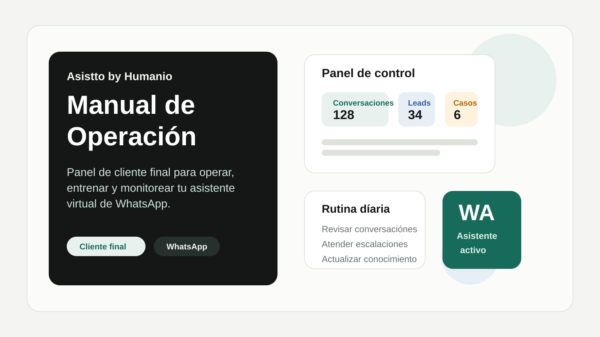
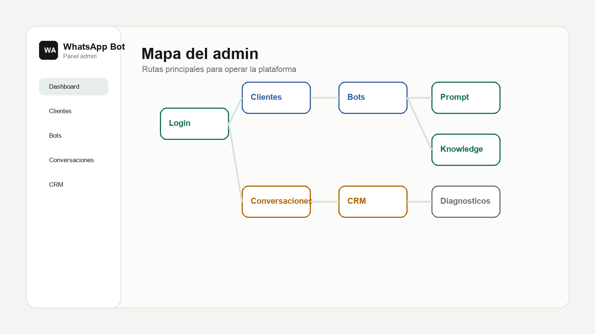
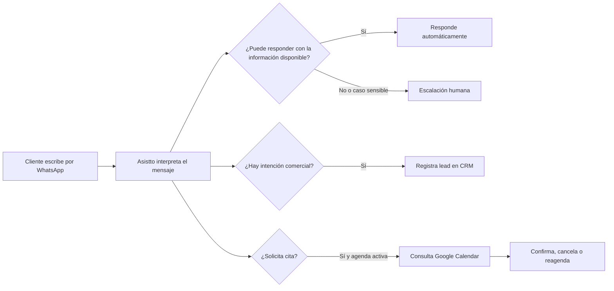
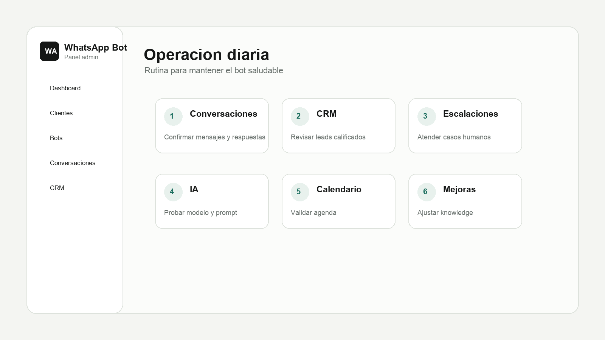
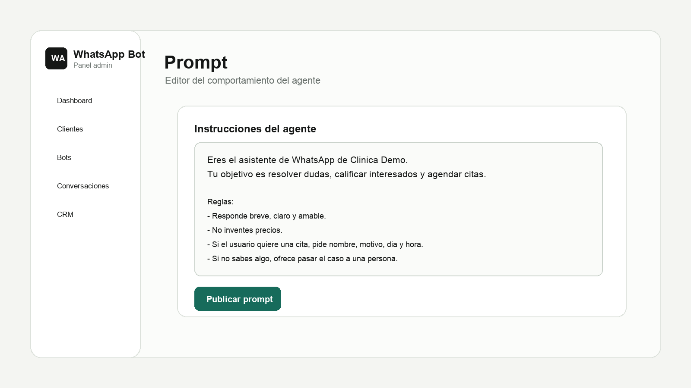
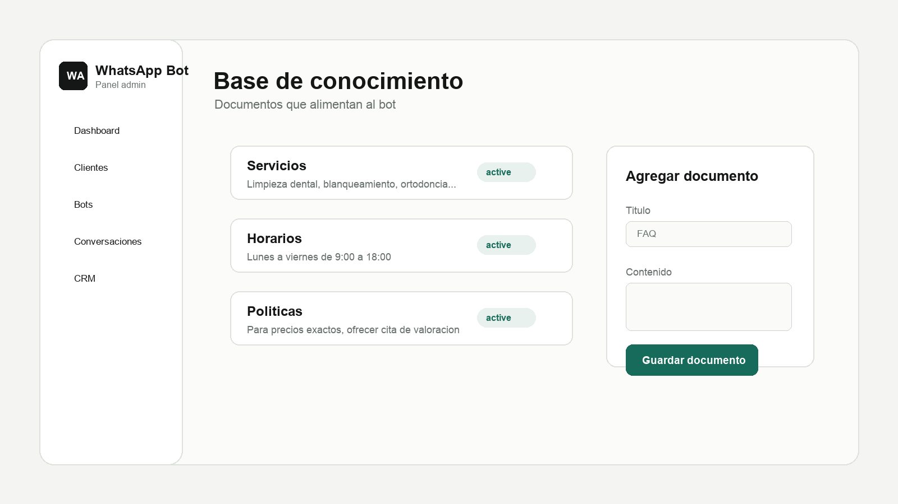

# Manual de Operación para Cliente Final

| Documento | Plataforma | Audiencia | Objetivo |
| --- | --- | --- | --- |
| Manual de operación | Asistto by Humanio | Cliente final | Operar, entrenar y monitorear el asistente virtual de WhatsApp sin conocimientos técnicos. |

> **Resumen rápido:** Asistto atiende mensajes de WhatsApp, responde con la información de tu negocio, califica interesados, agenda citas si la habilidad está activa y transfiere a una persona cuando el caso requiere atención humana.

---

## Índice

| Sección | Para qué sirve |
| --- | --- |
| [1. Mapa general](#1-mapa-general) | Entender cómo se conecta WhatsApp, el bot, el panel y tu equipo. |
| [2. Acceso al panel](#2-acceso-al-panel) | Entrar al sistema y reconocer las áreas principales. |
| [3. Dashboard](#3-dashboard) | Leer las métricas operativas del asistente. |
| [4. Conversaciones](#4-conversaciones) | Auditar chats y dar seguimiento manual. |
| [5. CRM de prospectos](#5-crm-de-prospectos) | Revisar leads, estados y prioridades. |
| [6. Escalaciones humanas](#6-escalaciones-humanas) | Atender casos donde el bot debe guardar silencio. |
| [7. Entrenamiento del bot](#7-entrenamiento-del-bot) | Editar prompt y base de conocimiento. |
| [8. Google Calendar](#8-google-calendar) | Entender agenda, cancelación y reagendado automático. |
| [9. Rutina recomendada](#9-rutina-recomendada) | Mantener el bot saludable cada día y cada semana. |

---

## 1. Mapa general

### Conceptos clave

| Concepto | Qué significa | Dónde lo revisas |
| --- | --- | --- |
| **Asistente o bot** | Agente de inteligencia artificial entrenado con la información de tu negocio. | Dashboard, conversaciones y configuración del bot. |
| **Prompt** | Instrucciones que definen tono, reglas, límites y comportamiento. | `Configuración > Prompt` |
| **Base de conocimiento** | Documentos con servicios, precios, horarios, políticas y preguntas frecuentes. | `Configuración > Base de conocimiento` |
| **Lead** | Persona que mostró interés, dejó datos o pidió contacto, compra o cita. | CRM de prospectos |
| **Lead calificado** | Prospecto con intención clara o datos suficientes para seguimiento comercial. | CRM de prospectos |
| **Escalación humana** | Caso donde el bot deja de responder para que una persona atienda. | Bandeja de escalaciones |

---

## 2. Acceso al panel

Para ingresar al panel operativo:

1. Abre el dominio provisto por tu administrador, por ejemplo: `https://bot.humanio.digital/admin`.
2. Escribe tu correo electrónico.
3. Escribe la contraseña temporal proporcionada por tu agencia.
4. Haz clic en **Ingresar**.

> **Recomendación:** guarda la dirección del panel en favoritos para entrar rápidamente durante la operación diaria.

### Rutas rápidas

| Necesitas... | Ve a... | Acción recomendada |
| --- | --- | --- |
| Ver el estado general del bot | Dashboard | Revisa conversaciones, mensajes, leads y escalaciones. |
| Leer una conversación específica | Conversaciones | Busca el chat y confirma si el bot respondió correctamente. |
| Dar seguimiento comercial | CRM de prospectos | Filtra por leads calificados o casos en progreso. |
| Atender un problema sensible | Escalaciones | Toma el control por WhatsApp y resuelve manualmente. |
| Cambiar cómo responde el bot | Prompt | Ajusta reglas, tono y límites. |
| Agregar información del negocio | Base de conocimiento | Sube o actualiza documentos operativos. |

---

## 3. Dashboard

El Dashboard muestra el desempeño del asistente en tiempo real. Úsalo como tablero de salud diaria.

| Métrica | Qué indica | Cómo interpretarla |
| --- | --- | --- |
| **Conversaciones** | Chats únicos iniciados por clientes. | Mide volumen de atención. |
| **Mensajes** | Total de mensajes procesados. | Ayuda a detectar días de alta demanda. |
| **Leads** | Prospectos capturados durante las conversaciones. | Indica interés comercial generado por WhatsApp. |
| **Leads calificados** | Prospectos con intención clara de compra, cita o contacto. | Prioridad para seguimiento comercial. |
| **Escalaciones pendientes** | Casos que necesitan intervención humana. | Deben revisarse primero. |

### Lectura rápida del estado

| Si ves... | Puede significar... | Qué hacer |
| --- | --- | --- |
| Muchas conversaciones y pocos leads | El bot responde dudas, pero no está guiando a conversión. | Revisa el prompt y agrega una regla para capturar intención. |
| Muchas escalaciones | Falta información o hay casos sensibles frecuentes. | Actualiza la base de conocimiento y revisa los motivos. |
| Muchos leads en progreso | Los clientes aún no completan datos. | Ajusta el flujo para pedir nombre, motivo y horario de forma más clara. |

---

## 4. Conversaciones

En **Conversaciones** puedes auditar lo que ocurre entre el bot y tus clientes.

| Elemento | Qué verás | Uso operativo |
| --- | --- | --- |
| Mensajes del cliente | Preguntas, respuestas y solicitudes recibidas por WhatsApp. | Detectar dudas frecuentes o problemas reales. |
| Mensajes del bot | Respuestas automáticas generadas por Asistto. | Validar tono, precisión y claridad. |
| Estado de procesamiento | Mensaje visible antes de que el bot termine de responder. | Saber que el sistema recibió el mensaje. |
| Seguimiento por WhatsApp | Botón para abrir el chat en WhatsApp Web. | Responder manualmente cuando haga falta. |

> **Buena práctica:** revisa conversaciones reales al menos una vez al día. Si notas que varios clientes preguntan lo mismo, convierte esa respuesta en un documento de base de conocimiento.

---

## 5. CRM de prospectos

El CRM organiza la información comercial que el bot detecta durante las conversaciones.

| Campo | Descripción | Ejemplo |
| --- | --- | --- |
| **Nombre** | Nombre capturado durante el chat. | Ana López |
| **Negocio / motivo** | Resumen de lo que necesita el cliente. | Quiere valoración dental |
| **Estado** | Nivel de avance del prospecto. | En progreso, calificado o descalificado |
| **Origen** | Canal desde el que llegó el contacto. | WhatsApp |
| **Última actividad** | Momento del último mensaje o cambio de estado. | Hoy, 11:42 AM |

### Estados de un lead

| Estado | Cuándo aparece | Qué hacer |
| --- | --- | --- |
| `En progreso` | La persona sigue conversando o faltan datos. | Espera o revisa si conviene intervenir. |
| `Calificado` | La persona pidió cita, contacto, cotización o mostró intención clara. | Da seguimiento comercial cuanto antes. |
| `Descalificado` | No encaja con tus servicios o no cumple criterios mínimos. | Revisa el motivo y archiva si corresponde. |

---

## 6. Escalaciones humanas

Una escalación ocurre cuando Asistto detecta que el caso necesita atención de una persona. En ese momento, el bot debe dejar de responder para evitar confusión.

| Motivo común | Ejemplo de mensaje del cliente | Acción recomendada |
| --- | --- | --- |
| Queja o problema sensible | "Mi producto llegó roto" | Responde manualmente y registra el caso. |
| Solicitud fuera de alcance | "Necesito hablar con un gerente" | Toma el control y canaliza internamente. |
| Información no disponible | "¿Tienen convenio con mi aseguradora?" | Actualiza la base de conocimiento si la respuesta será recurrente. |
| Caso emocional o urgente | "Estoy muy molesto, nadie me responde" | Atiende con prioridad humana. |

> **Regla de oro:** cuando un caso esté escalado, responde desde WhatsApp Web o desde el canal definido por tu operación. Evita modificar el prompt mientras una conversación sensible está en curso.

---

## 7. Entrenamiento del bot

No necesitas editar código para cambiar lo que responde el asistente. La operación se controla desde dos áreas: **Prompt** y **Base de conocimiento**.

### 7.1 Prompt: personalidad y reglas

Ruta: `Configuración > Prompt`

El prompt define cómo debe comportarse el bot: tono, límites, preguntas obligatorias, reglas comerciales y momentos de escalación.

| Tipo de regla | Ejemplo útil |
| --- | --- |
| Tono | "Responde de manera breve, clara y amable." |
| Límite | "No inventes precios si no están en la base de conocimiento." |
| Captura de datos | "Antes de agendar, pide nombre completo, motivo, día y hora deseada." |
| Escalación | "Si el cliente reporta un problema con un producto o servicio, transfiere a una persona." |
| Estilo | "Evita respuestas largas; máximo 3 líneas por mensaje." |

#### Asistente con IA para mejorar el prompt

En el editor puedes encontrar un cuadro de ayuda con inteligencia artificial. Puedes escribir una instrucción sencilla, por ejemplo:

> "Haz que el bot sea más amable, pero que siga pidiendo nombre, motivo y horario antes de agendar."

Después:

1. Haz clic en **Generar**.
2. Revisa la propuesta.
3. Aplica el cambio si te convence.
4. Haz clic en **Publicar** para guardar la versión activa del bot.

### 7.2 Base de conocimiento: información del negocio

Ruta: `Configuración > Base de conocimiento`

La base de conocimiento es la memoria operativa del bot. Ahí debes colocar lo que el asistente puede usar para responder.

| Documento recomendado | Qué debe incluir |
| --- | --- |
| **Horarios y sucursales** | Direcciones, enlaces a Google Maps, horarios y días no laborables. |
| **Servicios y paquetes** | Descripción de servicios, condiciones, precios base y restricciones. |
| **Preguntas frecuentes** | Estacionamiento, métodos de pago, requisitos, duración de citas y políticas. |
| **Políticas comerciales** | Cancelaciones, reembolsos, anticipos, garantías y excepciones. |
| **Criterios de calificación** | Qué datos debe pedir el bot para considerar a alguien como lead calificado. |

> **Importante:** el bot no debe inventar información. Si un dato no está en el prompt o en la base de conocimiento, el asistente debe decir que no cuenta con esa información y ofrecer atención humana.

---

## 8. Google Calendar

Si la habilidad de agenda está activa, Asistto puede consultar tu Google Calendar para crear, cancelar o reagendar citas.

### Flujo de agenda

| Paso | Qué ocurre |
| --- | --- |
| 1 | El cliente pide una cita por WhatsApp. |
| 2 | El bot solicita nombre completo, motivo, día y hora deseada. |
| 3 | Asistto consulta Google Calendar en tiempo real. |
| 4 | Si el horario está ocupado, propone otra opción o pide un nuevo horario. |
| 5 | Si el horario está libre, crea el evento y confirma por WhatsApp. |

### Cancelaciones y reagendados

| Solicitud del cliente | Qué hace el bot |
| --- | --- |
| "Cancela mi cita" | Busca el evento asociado al número de teléfono, elimina la cita y confirma la cancelación. |
| "Mejor muévela a las 12" | Busca la cita anterior, valida disponibilidad y registra el nuevo horario si está libre. |
| "No podré asistir mañana" | Pide nueva fecha u horario si la información es insuficiente. |

---

## 9. Rutina recomendada

### Checklist diario

| Hecho | Tarea | Resultado esperado |
| --- | --- | --- |
| [ ] | Revisar Dashboard | Detectar cambios fuertes en actividad, leads o escalaciones. |
| [ ] | Revisar Conversaciones | Confirmar que el bot responde con claridad y precisión. |
| [ ] | Atender Escalaciones | Resolver casos humanos antes de que se enfríen. |
| [ ] | Revisar CRM | Dar seguimiento a leads calificados. |
| [ ] | Anotar dudas frecuentes | Preparar mejoras para la base de conocimiento. |

### Checklist semanal

| Hecho | Tarea | Resultado esperado |
| --- | --- | --- |
| [ ] | Actualizar precios, horarios o servicios | Evitar respuestas desactualizadas. |
| [ ] | Revisar leads descalificados | Ajustar criterios si se están perdiendo oportunidades. |
| [ ] | Optimizar prompt | Corregir frases repetidas, tono o pasos confusos. |
| [ ] | Probar agenda | Confirmar que Google Calendar crea y mueve citas correctamente. |
| [ ] | Revisar políticas de WhatsApp | Mantener mensajes limpios, útiles y permitidos por Meta. |

---

## 10. Buenas prácticas

| Principio | Recomendación |
| --- | --- |
| Mantén la información viva | Si cambia un precio, horario, ubicación o política, actualízalo en el panel el mismo día. |
| Escribe reglas simples | El bot obedece mejor instrucciones directas que párrafos largos y ambiguos. |
| Audita conversaciones reales | Las dudas de tus clientes muestran qué falta documentar. |
| No uses el bot para spam | WhatsApp prohíbe envíos masivos no solicitados y mensajes engañosos. |
| Escala cuando haga falta | Los casos sensibles deben atenderse por una persona. |

---

## 11. Guía de solución rápida

| Problema | Revisión inicial | Solución probable |
| --- | --- | --- |
| El bot responde algo incorrecto | Revisa si el dato existe en base de conocimiento. | Corrige o agrega el documento correspondiente. |
| El bot responde demasiado largo | Revisa el prompt. | Agrega una regla de longitud máxima. |
| El bot no agenda | Confirma si la habilidad de Google Calendar está activa. | Pide al administrador revisar la conexión. |
| El bot no sabe un precio | Revisa documentos de servicios y paquetes. | Agrega el precio o define que debe pedir cita. |
| Hay muchas escalaciones | Revisa motivos frecuentes. | Agrega respuestas, políticas o criterios faltantes. |

---

## Cierre operativo

Asistto funciona mejor cuando el panel se trata como una herramienta viva: se revisa, se alimenta y se ajusta con base en conversaciones reales. La combinación correcta es simple:

| Operación | Frecuencia ideal |
| --- | --- |
| Revisar conversaciones y escalaciones | Diario |
| Dar seguimiento a leads calificados | Diario |
| Actualizar base de conocimiento | Cada vez que cambie información del negocio |
| Optimizar prompt | Semanal o cuando detectes un patrón |
| Probar agenda y flujos críticos | Semanal |
