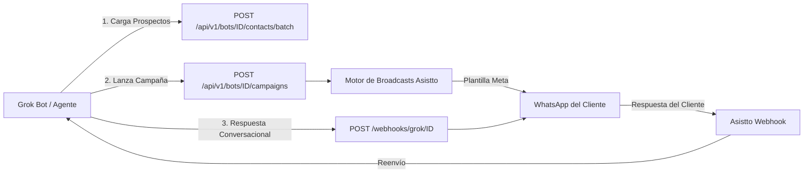

# API REST de Asistto - Conexión Externa y Grok Bot

Esta documentación describe la API REST de **Asistto by Humanio** (`/api/v1`) diseñada para integrar sistemas externos, bots autónomos (como **Grok Bot**), pipelines de prospección automatizada, scrapers, CRMs y agentes de ventas.

---

## 1. Arquitectura General y Flujo de Prospección

La conexión entre Grok Bot y Asistto opera en dos fases complementarias:

1. **Fase Saliente (Outbound / Prospección y Campañas)**:
   - Grok Bot identifica o recopila prospectos calificados.
   - Grok Bot los registra en Asistto vía `POST /api/v1/bots/{bot_id}/contacts/batch`.
   - Grok Bot dispara una campaña vía `POST /api/v1/bots/{bot_id}/campaigns` usando una plantilla aprobada por Meta WhatsApp Cloud API.
   - Asistto procesa la cola de envíos en segundo plano de manera controlada y segura.

2. **Fase Entrante y Conversacional (Inbound / Ventana de 24 horas)**:
   - Cuando el prospecto responde por WhatsApp, Asistto recibe el webhook de Meta y abre la ventana libre de 24 horas.
   - Si la integración con Grok Bot está activa, Asistto reenvía el mensaje al webhook configurado en Grok Bot.
   - Grok Bot procesa la respuesta y contesta de vuelta a `POST /webhooks/grok/{bot_id}` para continuar la conversación y la venta consultiva.



---

## 2. Autenticación y Seguridad

Cada bot dispone de credenciales dedicadas. Para autenticar cualquier petición hacia `/api/v1`:

### Métodos de autenticación aceptados:
1. **Header personalizado**: `X-API-Key: <tu-secreto>`
2. **Header de Grok**: `X-Grok-Secret: <tu-secreto>`
3. **Bearer Token estándar**: `Authorization: Bearer <tu-secreto>`

> **¿Dónde obtener el secreto?**
> En el Panel de Cliente de Asistto (`/client/app` -> Pestaña **Integraciones** -> Tarjeta **Grok Bot**), en el campo **Secreto de Validación**. El valor se almacena cifrado con Fernet AES-256 en base de datos.

---

## 3. Catálogo de Endpoints

### 3.1. Verificar Conectividad
* **Endpoint**: `GET /api/v1/bots/{bot_id}/ping`
* **Descripción**: Comprueba que el `bot_id` exista y que el token de autenticación sea válido.
* **Respuesta (200 OK)**:
```json
{
  "status": "ok",
  "bot_id": 42,
  "bot_name": "Asistto Inmobiliario",
  "bot_slug": "inmobiliario-cdmx",
  "phone_configured": true
}
```

---

### 3.2. Carga Individual de Prospecto
* **Endpoint**: `POST /api/v1/bots/{bot_id}/contacts`
* **Descripción**: Registra o actualiza un prospecto en el Directorio de Contactos y en el CRM de Leads de Asistto.
* **Cuerpo de la Petición**:
```json
{
  "wa_id": "+52 1 55 1234 5678",
  "name": "Carlos Mendoza",
  "business": "Restaurante La Central",
  "tags": ["prospecto_grok", "campaña_octubre"],
  "notes": "Prospecto generado por agente Grok",
  "qualification_status": "en_progreso"
}
```
* **Respuesta (200 OK)**:
```json
{
  "status": "success",
  "bot_id": 42,
  "wa_id": "5215512345678",
  "name": "Carlos Mendoza",
  "business": "Restaurante La Central",
  "tags": "prospecto_grok, campaña_octubre"
}
```

---

### 3.3. Carga Masiva de Prospectos (Batch)
* **Endpoint**: `POST /api/v1/bots/{bot_id}/contacts/batch`
* **Descripción**: Carga hasta 1,000 prospectos en una sola llamada atómica.
* **Cuerpo de la Petición**:
```json
{
  "contacts": [
    {
      "wa_id": "5215511111111",
      "name": "Andrea Morales",
      "business": "Clínica Dental Sur",
      "tags": ["prospecto_grok", "salud"]
    },
    {
      "wa_id": "5215522222222",
      "name": "Roberto Soto",
      "business": "Ferretería El Tornillo",
      "tags": ["prospecto_grok", "retail"]
    }
  ]
}
```
* **Respuesta (200 OK)**:
```json
{
  "status": "success",
  "bot_id": 42,
  "total_received": 2,
  "success_count": 2,
  "failed_count": 0,
  "failed_items": []
}
```

---

### 3.4. Consultar Plantillas Aprobadas de WhatsApp
* **Endpoint**: `GET /api/v1/bots/{bot_id}/templates`
* **Descripción**: Devuelve en tiempo real las plantillas aprobadas por Meta para este número de WhatsApp, con sus parámetros y estructura.
* **Respuesta (200 OK)**:
```json
{
  "bot_id": 42,
  "total_templates": 2,
  "templates": [
    {
      "name": "promocion_reactivacion_v1",
      "status": "APPROVED",
      "category": "MARKETING",
      "language": "es_MX",
      "components": [
        {
          "type": "BODY",
          "text": "Hola {{1}}, tenemos una propuesta exclusiva para {{2}} con Asistto."
        }
      ]
    }
  ]
}
```

---

### 3.5. Crear y Lanzar Campaña Masiva
* **Endpoint**: `POST /api/v1/bots/{bot_id}/campaigns`
* **Status**: `202 Accepted`
* **Descripción**: Crea la campaña, asigna los destinatarios y encola el envío en segundo plano.

#### Ejemplo 1: Enviar por etiqueta (Tag)
```json
{
  "name": "Campaña Prospección Octubre Grok",
  "template_name": "promocion_reactivacion_v1",
  "language_code": "es_MX",
  "audience": {
    "type": "tag",
    "tag": "prospecto_grok"
  },
  "variable_mappings": [
    { "var_idx": 1, "type": "name" },
    { "var_idx": 2, "type": "business" }
  ],
  "scheduled_at": null
}
```

#### Ejemplo 2: Enviar a lista explícita de destinatarios (Recipients)
```json
{
  "name": "Campaña Flash Directa",
  "template_name": "bienvenida_directa_v1",
  "language_code": "es_MX",
  "audience": {
    "type": "recipients",
    "recipients": [
      { "wa_id": "5215512345678", "name": "Carlos Mendoza", "business": "La Central" }
    ]
  },
  "variable_mappings": [
    { "var_idx": 1, "type": "name" }
  ]
}
```

#### Tipos de variables en `variable_mappings`:
* `"name"`: Inserta dinámicamente el nombre del contacto.
* `"business"`: Inserta dinámicamente la empresa o negocio del contacto.
* `"wa_id"`: Inserta el número telefónico.
* `"fixed"`: Inserta un valor fijo indicado en `"value"`.

* **Respuesta (202 Accepted)**:
```json
{
  "status": "queued",
  "campaign_id": 105,
  "name": "Campaña Prospección Octubre Grok",
  "template_name": "promocion_reactivacion_v1",
  "recipients_count": 45,
  "scheduled_at": null
}
```

---

### 3.6. Consultar Estado y Métricas de una Campaña
* **Endpoint**: `GET /api/v1/bots/{bot_id}/campaigns/{campaign_id}/status`
* **Descripción**: Muestra métricas de entrega en tiempo real.
* **Respuesta (200 OK)**:
```json
{
  "campaign_id": 105,
  "bot_id": 42,
  "name": "Campaña Prospección Octubre Grok",
  "template_name": "promocion_reactivacion_v1",
  "language_code": "es_MX",
  "status": "completed",
  "total_recipients": 45,
  "sent_count": 45,
  "failed_count": 0,
  "created_at": "2026-10-05T17:30:00Z",
  "updated_at": "2026-10-05T17:31:15Z",
  "scheduled_at": null
}
```

---

## 4. Ejemplos de Implementación

### Python (`httpx` / `requests`)

```python
import httpx

BASE_URL = "https://bot.tudominio.com"
BOT_ID = 42
API_SECRET = "tu-secreto-de-validacion"

headers = {
    "X-API-Key": API_SECRET,
    "Content-Type": "application/json"
}

# 1. Subir prospectos en lote
prospects_payload = {
    "contacts": [
        {
            "wa_id": "5215512345678",
            "name": "Carlos Mendoza",
            "business": "Restaurante La Central",
            "tags": ["grok_outreach"]
        }
    ]
}

res = httpx.post(
    f"{BASE_URL}/api/v1/bots/{BOT_ID}/contacts/batch",
    json=prospects_payload,
    headers=headers
)
print("Prospectos subidos:", res.json())

# 2. Lanzar campaña WhatsApp
campaign_payload = {
    "name": "Grok Outreach - Lote 1",
    "template_name": "promocion_reactivacion_v1",
    "language_code": "es_MX",
    "audience": {
        "type": "tag",
        "tag": "grok_outreach"
    },
    "variable_mappings": [
        {"var_idx": 1, "type": "name"},
        {"var_idx": 2, "type": "business"}
    ]
}

camp_res = httpx.post(
    f"{BASE_URL}/api/v1/bots/{BOT_ID}/campaigns",
    json=campaign_payload,
    headers=headers
)
print("Campaña iniciada:", camp_res.json())
```

### cURL

```bash
# Carga masiva de prospectos
curl -X POST "https://bot.tudominio.com/api/v1/bots/42/contacts/batch" \
  -H "X-API-Key: tu-secreto-de-validacion" \
  -H "Content-Type: application/json" \
  -d '{
    "contacts": [
      {
        "wa_id": "5215512345678",
        "name": "Carlos Mendoza",
        "business": "Restaurante La Central",
        "tags": ["grok_lead"]
      }
    ]
  }'

# Lanzar campaña
curl -X POST "https://bot.tudominio.com/api/v1/bots/42/campaigns" \
  -H "X-API-Key: tu-secreto-de-validacion" \
  -H "Content-Type: application/json" \
  -d '{
    "name": "Campaña Grok",
    "template_name": "promocion_reactivacion_v1",
    "language_code": "es_MX",
    "audience": { "type": "tag", "tag": "grok_lead" },
    "variable_mappings": [{ "var_idx": 1, "type": "name" }]
  }'
```

---

## 5. Documentación Interactiva (Swagger / OpenAPI)

* **Swagger UI**: `https://tu-dominio/docs`
* **ReDoc**: `https://tu-dominio/redoc`
* **OpenAPI JSON**: `https://tu-dominio/openapi.json`
